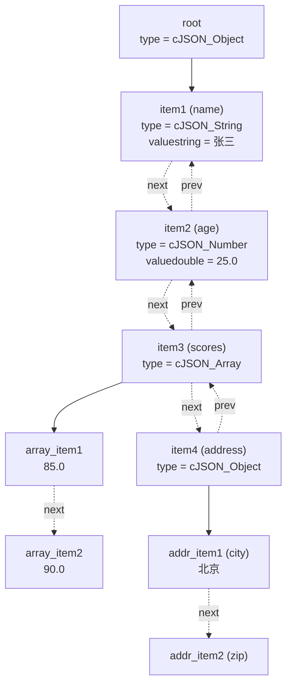

# 任务2：cJSON源码逻辑可视化分析

## 一、核心数据结构分析

### 1.1 struct cJSON 完整定义
```c
typedef struct cJSON
{
    /* next/prev allow you to walk array/object chains. */
    struct cJSON *next;    // 指向同级别下一个节点
    struct cJSON *prev;    // 指向同级别上一个节点
    
    /* An array or object item will have a child pointer pointing to a chain 
       of the items in the array/object. */
    struct cJSON *child;   // 指向第一个子节点
    
    /* The type of the item, as above. */
    int type;              // 节点类型标识
    
    /* The item's string, if type==cJSON_String */
    char *valuestring;     // 字符串值
    
    /* writing to valueint is DEPRECATED */
    int valueint;          // 整数值（已废弃）
    
    /* The item's number, if type==cJSON_Number */
    double valuedouble;    // 浮点数值
    
    /* The item's name string, if this item is the child of an object */
    char *string;          // 键名（对象成员的名称）
} cJSON;
```

### 1.2 成员详细说明
| 成员 | 类型 | 说明 |
|------|------|------|
| `next` | `struct cJSON*` | 指向同级下一个节点，构成双向链表 |
| `prev` | `struct cJSON*` | 指向同级上一个节点 |
| `child` | `struct cJSON*` | 指向第一个子节点（对象/数组的元素） |
| `type` | `int` | 节点类型：cJSON_String/Number/Object/Array等 |
| `valuestring` | `char*` | 字符串值（type为cJSON_String时使用） |
| `valueint` | `int` | 整数值（已废弃，保留兼容性） |
| `valuedouble` | `double` | 浮点数值（type为cJSON_Number时使用） |
| `string` | `char*` | 键名（作为对象成员时使用） |

### 1.3 节点类型定义
```c
 #define cJSON_Invalid 0
 #define cJSON_False 1
 #define cJSON_True 2
 #define cJSON_NULL 4
 #define cJSON_Number 8
 #define cJSON_String 16
 #define cJSON_Array 32
 #define cJSON_Object 64
 #define cJSON_Raw 128
 #define cJSON_IsReference 256
 #define cJSON_StringIsConst 512
```

## 二、数据结构可视化

### 2.1示例JSON 
```c
{
"name": "张三",
"age": 25,
"scores": [85, 90, 78],
"address": {
"city": "北京",
"zip": "100000"
}
}
```

### 2.2 内存结构示意图


### 2.3 双向链表结构图
    ┌──────────┐     ┌──────────┐     ┌──────────┐
    │  prev    │◄────│  prev    │◄────│  prev    │
    │  NULL    │     │          │     │          │
    ├──────────┤     ├──────────┤     ├──────────┤
    │  next    │────►│  next    │────►│  next    │
    │          │     │          │     │  NULL    │
    ├──────────┤     ├──────────┤     ├──────────┤
    │  child   │     │  child   │     │  child   │
    │  NULL    │     │  NULL    │     │    │     │
    └──────────┘     └──────────┘     └────┼─────┘
                                            │
                                       ┌────┴────┐
                                       │ 子节点链 │
                                       └─────────┘


## 三、核心流程分析

### 3.1 cJSON_Parse函数调用链

```mermaid
flowchart TD

    A["cJSON_Parse(const char* value)"]
    B["cJSON_ParseWithOpts(value, NULL, 0)"]
    C["parse_value(cJSON* item, const char** value)"]
    D{"根据第一个字符判断"}

    E["parse_object()"]
    F["parse_array()"]
    G["parse_string()"]
    H["parse_true()"]
    I["parse_false()"]
    J["parse_null()"]
    K["parse_number()"]

    L["返回解析结果"]

    A --> B
    B --> C
    C --> D

    D -->| '{' | E
    D -->| '[' | F
    D -->| '\"' | G
    D -->| 't' | H
    D -->| 'f' | I
    D -->| 'n' | J
    D -->| 其他 | K

    E --> L
    F --> L
    G --> L
    H --> L
    I --> L
    J --> L
    K --> L
```

### 3.2 parse_object 流程图

```mermaid
flowchart TD

    A["开始解析对象"]
    B["跳过 '{' 和空白字符"]
    C{"检查下一个字符"}

    D["返回对象"]
    E["解析键名<br/>parse_string()"]
    F["跳过 ':' 和空白字符"]
    G["解析值<br/>parse_value()"]
    H["将键值对添加到链表"]

    I{"是否为 ',' ?"}
    J{"是否为 '}' ?"}
    K["解析失败<br/>返回 NULL"]

    A --> B
    B --> C

    C -->| '}' | D
    C -->| 其他 | E

    E --> F
    F --> G
    G --> H
    H --> I

    I -->| 是 | C
    I -->| 否 | J

    J -->| 是 | D
    J -->| 否 | K
```

### 3.3 parse_array 流程图

```mermaid
flowchart TD

    A["开始解析数组"]
    B["跳过 '[' 和空白字符"]
    C{"检查下一个字符"}

    D["返回数组"]
    E["解析元素<br/>parse_value()"]
    F["将元素添加到链表"]

    G{"是否为 ',' ?"}
    H{"是否为 ']' ?"}
    I["解析失败<br/>返回 NULL"]

    A --> B
    B --> C

    C -->| ']' | D
    C -->| 其他 | E

    E --> F
    F --> G

    G -->| 是 | C
    G -->| 否 | H

    H -->| 是 | D
    H -->| 否 | I
```

## 四、总结

### 4.1 核心设计思想
**1.统一的数据结构：**用一个结构体表示所有JSON类型

**2.链表和树形结构：**next/prev实现同级遍历，child实现嵌套访问

**3.递归下降解析：**语法规则与代码结构一一对应

### 4.2 收获
通过分析cJSON源码，我深入理解了C语言指针和内存管理的实际应用和递归下降解析算法的实现原理，了解了如何设计简洁易用的API接口以及工业级代码的质量标准。
